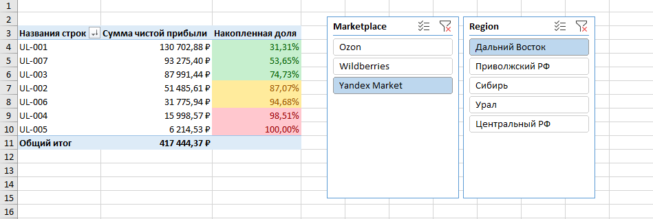
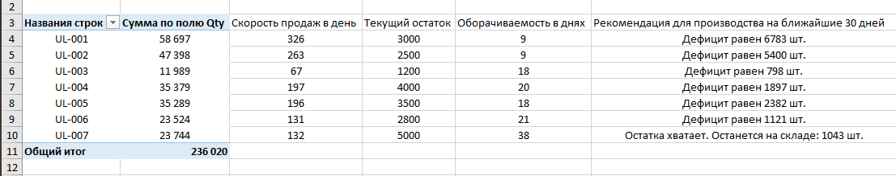

# Экосистема сквозной аналитики и управления запасами для e-Commerce (200k+ транзакций)

## 📌 Описание проекта
Масштабный аналитический проект по моделированию, очистке и анализу коммерческих показателей производственной компании (категория: "Деревянные развивающие игрушки"). Проект симулирует реальную бизнес-цепочку: от производства на фабрике в Нижнем Новгороде до омниканальных продаж на крупнейших маркетплейсах РФ (Wildberries, Ozon, Яндекс Маркет).

В основе проекта лежит массив данных объемом **200 000+ транзакций**, развернутый с помощью Python. На базе этих данных построен автоматизированный конвейер очистки (ETL) и интерактивная система поддержки принятия решений (DSS).

---

## 🛠 Технологический стек
* **Python (NumPy, Pandas, Datetime):** Генерация синтетического датасета, моделирование рыночных долей маркетплейсов, бизнес-логики ценообразования и умышленного внесения текстовых аномалий для стресс-тестирования модели.
* **Power Query (M-язык):** Развертывание ETL-процесса, обработка региональных стандартов, текстовый стриппинг, интеграция данных.
* **MS Excel:** Сводные таблицы, динамические срезы, условное форматирование, прогнозное моделирование запасов.

---

## 📐 Архитектура проекта по этапам

### Этап 1. Моделирование данных (Python)
Для создания полигона аналитики был написан скрипт, генерирующий три взаимосвязанных массива:
1. `1C_Production_Cost.csv` — номенклатурный справочник фабрики с плановой себестоимостью.
2. `Marketplaces_Raw_Sales.csv` — 200 000 строк «грязных» транзакций за 6 месяцев с учетом весов реального e-com рынка РФ.
3. `Export_Shipments.csv` — журнал ВЭД-поставок в ближнее и дальнее зарубежье.

### Этап 2. ETL-конвейер и очистка данных (Power Query)
В среде Power Query была выстроена отказоустойчивая модель обработки данных без использования "тяжелых" формул листа Excel:
* **Локализация:** Решен системный конфликт региональных стандартов (`en-US` локаль) при конвертации американского формата разделителя дробной части (точка) в российский.
* **Нормализация данных:** Проведена очистка текстовых аномалий в SKU — устранены скрытые пробелы на концах строк (функция `Усечь / Trim`) и ликвидирован разнобой регистра букв (`Upper`).
* **Интеграция (Data Merging):** Выполнено сквозное левостороннее соединение (Left Outer Join) транзакционного массива со справочником себестоимости 1С по ключу SKU.

### Этап 3. Юнит-экономика и ABC-анализ по чистой прибыли
Вместо классического учебного анализа по выручке, в проекте реализован **коммерческий ABC-анализ по Чистой Прибыли (`Net_Profit`)**, учитывающий комиссии площадок, логистику регионов и стоимость хранения.
* **Инсайт:** Выявлено ядро продуктовой матрицы (Группа А — 4 SKU из 7), генерирующее **80.55% всей чистой прибыли** компании (~86 млн руб. из 107 млн руб.).
* **Адаптация модели:** Границы групп были осознанно скорректированы вручную под физический смысл бизнеса (включение пограничного товара `UL-002` в группу лидеров на основе естественного разрыва коммерческой массы).
* 

### Этап 4. Управление запасами и планирование (Inventory Management)
Разработана прогнозная модель для предотвращения дефицита (Out-of-stock) и оптимизации оборотного капитала:
* Рассчитана ежедневная скорость продаж (**Run Rate**) по каждой позиции на основе полугодового тренда.
* Написана комплексная логическая формула, рассчитывающая оборачиваемость в днях и выдающая автоматическое техническое задание для производственного цеха на 30 дней вперед (с точным расчетом объема дефицита или свободного остатка на складе).
* 

---

## 📈 Ключевые бизнес-выводы (Data-Driven Decisions)
1. **Концентрация рисков:** Канал Wildberries генерирует **53% всей чистой прибыли компании (56.6 млн рублей)**. Сформирована рекомендация по диверсификации рисков через агрессивное масштабирование карточек на Ozon.
2. **Заморозка капитала:** Товары группы С (например, пирамидка `UL-005`) имеют избыточную оборачиваемость. Рекомендовано сократить объемы их выпуска, перенаправив освободившиеся производственные мощности на производство лидера категории — сортера `UL-001` (30% всей прибыли компании).

---

## 📂 Структура репозитория
* `Marketplace_Analytics_Model.xlsb` — Итоговый интерактивный дашборд со сводными таблицами, срезами и настроенной моделью Power Query.
* `dataset_generator.py` — Python-скрипт для генерации исходных массивов.
* `/raw_data/` — Папка с исходными сгенерированными CSV-файлами.
* `/images/` — Папка с изображениями.
